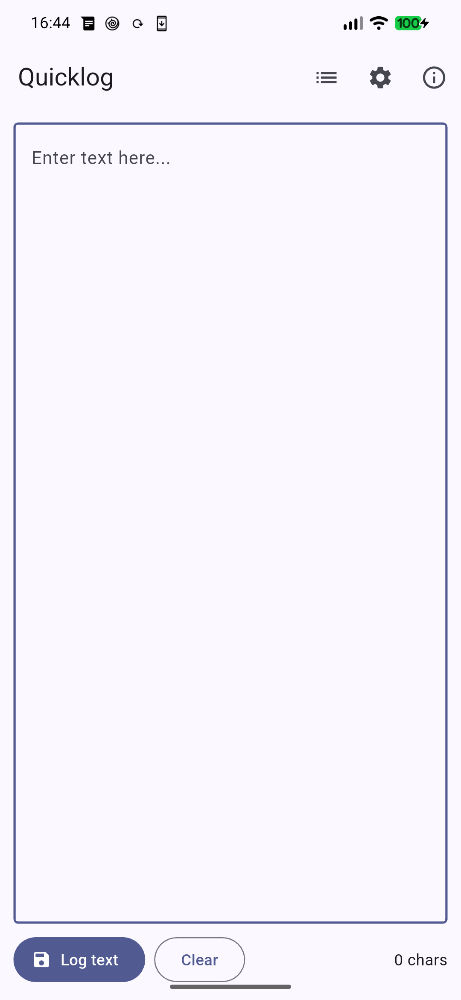
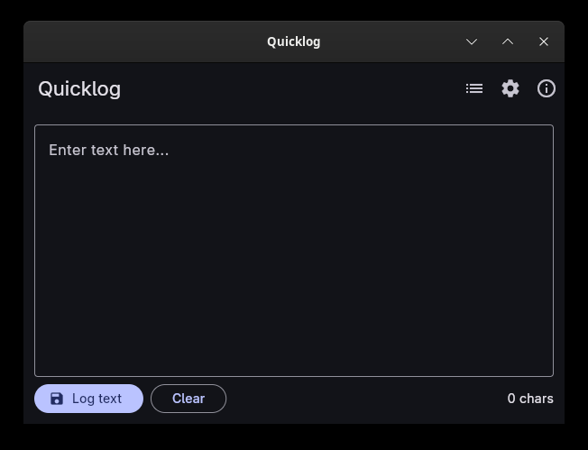

# Quicklog


Tiny GUI app to quickly jot a thought into a timestamped Markdown file.
Originally a Go/Fyne app called *Quicklogger* — this is the Flutter rewrite,
renamed to **Quicklog**, targeting Android (primary) and Linux desktop
(development).

The intent is the same as before: type a quick note on Android, hit **Log
text**, and let Syncthing copy the resulting `ql-YYMMDD-HHMMSS.md` file to your
home computer.




## Features

- Single-screen text editor with character counter and a one-shot warning at
  5,000 characters.
- Each press of **Log text** writes the current text to a new file named
  `ql-YYMMDD-HHMMSS.md` in the configured directory.
- **Preferences**: configurable log directory and an "Auto-log shared text"
  toggle.
- **Entry browser**: list of previous entries (newest first) with a viewer.
- **Edit entries**: from the list (pencil icon) or from the entry viewer. The
  editor writes back to the same file, so the note keeps its creation
  timestamp and its place in the list. Save and Revert stay disabled until
  something changes, and leaving with unsaved changes asks first.
- **Delete entries**: from the list (trash icon or long-press) or from the
  entry viewer. Deletion always goes through a full-screen confirmation that
  shows the filename, timestamp and a preview of the note — the file is
  removed for good, there is no trash folder.
- **Share to Quicklog** on Android: share text from any app and Quicklog
  either prefills the editor or logs it immediately, depending on the
  preference.

## Releases

Versions live in a single place: the `version:` line of `pubspec.yaml`, written
as `<semver>+<buildNumber>`. The build number is a plain counter — bump it by
one per release — and it has to stay below 1000 (see below). Android's
`versionName` and `versionCode` are derived from it, and every release commit
gets a matching `vX.Y.Z` git tag.

`.flutter-version` pins the Flutter SDK a release was built with; the F-Droid
build recipe reads it, so bump it whenever the toolchain moves.

Note that split APKs do not carry that number verbatim: Flutter's Gradle plugin
offsets it per ABI (`+1000` armeabi-v7a, `+2000` arm64-v8a, `+4000` x86_64), so
`0.1.3+8` ships as 1008 / 2008 / 4008. That offset is also why the counter must
stay below 1000 — otherwise two releases could land on the same APK version
code.

Quicklog is packaged for F-Droid, which builds it from source and signs it with
its own key. Store text, icon and screenshots come from
`fastlane/metadata/android/en-US/`, the build recipe to submit to `fdroiddata`
is [docs/fdroid/org.buetow.quicklog.yml](./docs/fdroid/org.buetow.quicklog.yml),
and the submission runbook is
[docs/fdroid-submission.md](./docs/fdroid-submission.md).

Release APKs built locally are signed with your own keystore if
`android/key.properties` exists (git-ignored; all four of `storeFile`,
`storePassword`, `keyAlias`, `keyPassword` are required, and the build fails
loudly if any are missing), and with the debug keys otherwise. A relative
`storeFile` is resolved against `android/app/`, not against the directory
`key.properties` itself lives in.

## Requirements

- [Flutter](https://flutter.dev) stable channel (3.41+).
- For Android builds: Android SDK + JDK 17 or 21. Fedora only packages 25 and
  26, which Gradle 8.14 refuses ("What went wrong: 25.0.4"), so install a
  Temurin build and point Flutter at it:
  `flutter config --jdk-dir=$HOME/jdk21`. GraalVM 17 from Fedora's repos works
  too. F-Droid's build server runs JDK 21; both 17 and 21 have been used to
  build the release APKs for this project.
- For Linux desktop builds: `gtk3-devel`, `mesa-demos`, `clang`, `cmake`,
  `ninja-build`, `pkg-config`, `xz-devel`.

## Build and Run

### Linux desktop

```sh
flutter run -d linux              # dev with hot reload
flutter build linux --release     # release bundle: build/linux/x64/release/bundle/
```

### Android

```sh
flutter run -d <device-id>        # dev on a connected device
flutter build apk --release       # fat APK with all ABIs
```

### Cross-compile from amd64 Linux to ARM Android APK

Unlike the previous Fyne build, no Docker / Podman / `fyne-cross` / NDK is
needed. Flutter's Dart AOT compiler emits ARM machine code directly from x86_64.

```sh
# Per-ABI split APKs (smaller, recommended for distribution)
flutter build apk --release --split-per-abi
# → build/app/outputs/flutter-apk/app-arm64-v8a-release.apk     (modern phones)
# → build/app/outputs/flutter-apk/app-armeabi-v7a-release.apk   (older 32-bit)
# → build/app/outputs/flutter-apk/app-x86_64-release.apk        (emulators)

# ARM64 only
flutter build apk --release --target-platform android-arm64
```

Install on the device:

```sh
adb install -r build/app/outputs/flutter-apk/app-arm64-v8a-release.apk
```

### Tests

```sh
flutter test
flutter analyze
```

## Share with Quicklog on Android

From any app that can share text, choose **Share** → **Quicklog**. With
auto-log off (default), the text opens in the editor for review. Toggle
"Auto-log shared text" in Preferences to have shared text written
straight to disk.

## Storage on Android

By default, log files are written to the app-specific external directory at
`/Android/data/org.buetow.quicklog/files/`. No storage permissions are
required; point Syncthing at that folder to sync to your home computer.

You can instead point **Preferences → Directory** at any other folder (e.g.
an existing notes vault) — doing so needs "All files access" or, on
GrapheneOS, Storage Scopes. See
[docs/installation.md](./docs/installation.md) for how to install the APK
and set that up, including a GrapheneOS Storage Scopes trick that avoids
granting broad filesystem access.
