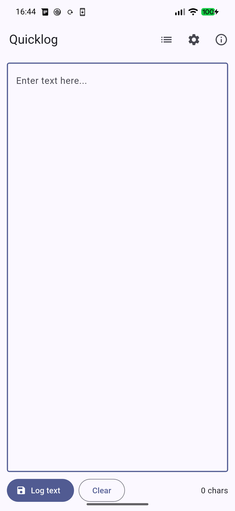
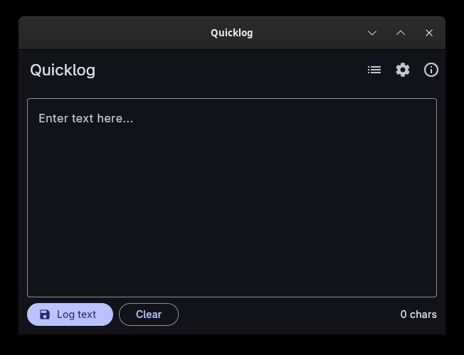

# Quicklog


Tiny GUI app to quickly jot a thought into a timestamped Markdown file.
Originally a Go/Fyne app called *Quicklogger* — this is the Flutter rewrite,
renamed to **Quicklog**, targeting Android (primary) and Linux desktop
(development).

The intent is the same as before: type a quick note on Android, hit **Log
text**, and let Syncthing copy the resulting `ql-YYMMDD-HHMMSS.md` file to your
home computer.




## Features

- Single-screen text editor with character counter and a one-shot warning at
  5,000 characters.
- Each press of **Log text** writes the current text to a new file named
  `ql-YYMMDD-HHMMSS.md` in the configured directory.
- **Preferences**: configurable log directory, Local vs S3 storage mode, and
  an "Auto-log shared text" toggle. S3 mode stores endpoint/region/bucket/keys
  on-device only (paste from `~/.config/garage/quicklog.env` on a laptop).
- **Settings backup**: Export settings / Import settings in Preferences write
  every setting to one JSON file you choose and restore it later, e.g. across
  an uninstall. See [Back up and restore settings](#back-up-and-restore-settings).
- **Optional S3**: same `ql-*.md` object keys against a path-style S3 endpoint
  (defaults aimed at Garage), either **S3 only** or **Local + S3** (dual
  write: every note lands in the local directory *and* the bucket). On S3
  failure a note is written to the local directory on the spot, so it is
  never lost and never asks you to re-save; the app then skips S3 for an
  hour with a Retry control. No telemetry; default remains local-only.
- **Entry browser**: list of previous entries (newest first) with a viewer.
- **Edit entries**: from the list (pencil icon) or from the entry viewer. The
  editor writes back to the same file, so the note keeps its creation
  timestamp and its place in the list. Save and Revert stay disabled until
  something changes, and leaving with unsaved changes asks first.
- **Delete entries**: from the list (trash icon or long-press) or from the
  entry viewer. Deletion always goes through a full-screen confirmation that
  shows the filename, timestamp and a preview of the note — the file is
  removed for good, there is no trash folder.
- **Share to Quicklog** on Android: share text from any app and Quicklog
  either prefills the editor or logs it immediately, depending on the
  preference.

## Install on Android

Install Quicklog from snonux's own F-Droid repository,
[snonux/fdroid](https://github.com/snonux/fdroid), and F-Droid keeps it
updated. That page has a one-tap link and a QR code to add the repository;
or in F-Droid go to *Settings → Repositories → +* and enter

- Address: `https://snonux.github.io/fdroid/repo`
- Fingerprint: `04B05FB0565543E058372B867B3D3A699D9D668388CE670478EDD4116D736DF7`

then search for Quicklog and install it. To build and install the APK
yourself instead, see [Build and Run](#android) and
[docs/installation.md](./docs/installation.md).

## Releases

Versions live in a single place: the `version:` line of `pubspec.yaml`, written
as `<semver>+<buildNumber>`. The build number is a plain counter — bump it by
one per release. Android's `versionName` and `versionCode` are derived from it,
and every release commit gets a matching `vX.Y.Z` git tag. The About dialog reads
the same line at runtime: `pubspec.yaml` is bundled as an asset and parsed by
`lib/services/app_version.dart`, so there is no version string to update by hand
(`test/about_dialog_test.dart` fails if the dialog ever drifts from it).

`.flutter-version` pins the Flutter SDK a release was built with; the F-Droid
build recipe reads it, so bump it whenever the toolchain moves.

Note that split APKs do not carry that number verbatim. `android/app/build.gradle.kts`
turns it into `buildNumber * 10 + abi`, with 1, 2 and 3 for armeabi-v7a, arm64-v8a
and x86_64, so `0.3.0+15` ships as 151 / 152 / 153. This is F-Droid's convention
and it replaces Flutter's own `abi * 1000 + buildNumber`, which would collide two
releases once the counter reached 1000.

Quicklog is packaged for F-Droid, which builds it from source and signs it with
its own key. Store text, icon and screenshots come from
`fastlane/metadata/android/en-US/`, the build recipe to submit to `fdroiddata`
is [docs/fdroid/org.buetow.quicklog.yml](./docs/fdroid/org.buetow.quicklog.yml),
and the submission runbook is
[docs/fdroid-submission.md](./docs/fdroid-submission.md).

Release APKs built locally are signed with your own keystore if
`android/key.properties` exists (git-ignored; all four of `storeFile`,
`storePassword`, `keyAlias`, `keyPassword` are required, and the build fails
loudly if any are missing), and with the debug keys otherwise. A relative
`storeFile` is resolved against `android/app/`, not against the directory
`key.properties` itself lives in.

## Requirements

- [Flutter](https://flutter.dev) stable channel (3.41+).
- For Android builds: Android SDK + JDK 17 or 21. Fedora only packages 25 and
  26, which Gradle 8.14 refuses ("What went wrong: 25.0.4"), so install a
  Temurin build and point Flutter at it:
  `flutter config --jdk-dir=$HOME/jdk21`. GraalVM 17 from Fedora's repos works
  too. F-Droid's build server runs JDK 21; both 17 and 21 have been used to
  build the release APKs for this project.
- For Linux desktop builds: `gtk3-devel`, `mesa-demos`, `clang`, `cmake`,
  `ninja-build`, `pkg-config`, `xz-devel`.

## Build and Run

### Linux desktop

```sh
flutter run -d linux              # dev with hot reload
flutter build linux --release     # release bundle: build/linux/x64/release/bundle/
```

### Android

```sh
flutter run -d <device-id>        # dev on a connected device
flutter build apk --release       # fat APK with all ABIs
```

### Cross-compile from amd64 Linux to ARM Android APK

Unlike the previous Fyne build, no Docker / Podman / `fyne-cross` / NDK is
needed. Flutter's Dart AOT compiler emits ARM machine code directly from x86_64.

```sh
# Per-ABI split APKs (smaller, recommended for distribution)
flutter build apk --release --split-per-abi
# → build/app/outputs/flutter-apk/app-arm64-v8a-release.apk     (modern phones)
# → build/app/outputs/flutter-apk/app-armeabi-v7a-release.apk   (older 32-bit)
# → build/app/outputs/flutter-apk/app-x86_64-release.apk        (emulators)

# ARM64 only
flutter build apk --release --target-platform android-arm64
```

Install on the device:

```sh
adb install -r build/app/outputs/flutter-apk/app-arm64-v8a-release.apk
```

### Tests

```sh
flutter test
flutter analyze
```

The optional live Garage smoke test uses `~/.config/garage/quicklog.env`.
To run it against an isolated S3 server instead, supply an env file with the
`GARAGE_*` variables documented below:

```sh
QUICKLOG_S3_SMOKE_ENV=/path/to/test-garage.env flutter test
```

An explicitly selected file must exist; a missing fixture fails the test.

## Share with Quicklog on Android

From any app that can share text, choose **Share** → **Quicklog**. With
auto-log off (default), the text opens in the editor for review. Toggle
"Auto-log shared text" in Preferences to have shared text written
straight to disk.

## Optional S3 mode

Preferences → **S3 only** writes notes as objects named `ql-YYMMDD-HHMMSS.md`
to a user-configured S3-compatible endpoint (path-style). Defaults target
`https://garage.f3s.buetow.org`, region `garage`, bucket `quicklog`. Paste the
access key and secret from `~/.config/garage/quicklog.env` on a development
machine; Android has no automatic import of that file. **Test connection**
probes without writing prefs; **Save** is what persists secrets. Credentials
live only in SharedPreferences and are never logged. If the S3 write fails
while logging, Quicklog writes that note to the local directory immediately
(same `ql-*.md` name) and tells you it was saved on this device — you do not
re-save it. The app then uses the local directory for new notes until you tap
**Retry S3** or an hour elapses / the app cold-starts.

In **S3 only** mode, recovery after an outage or a successful new S3 save also
moves local notes whose names are missing from the bucket: each is uploaded
and, once the upload is confirmed, its local copy is deleted, so the note ends
up in the bucket only. This covers **every** `ql-*.md` note in the notes
folder, not just the ones saved during an outage: switching from **Local
only** or **Local + S3** to **S3 only** therefore empties the folder into the
bucket (and, if the folder is shared with Syncthing, removes the notes from
the other devices too). Stay on **Local + S3** to keep a copy on the device.
A local copy is kept when its upload failed (it is retried), when the note
was edited on the device while its upload ran, when the bucket, account or
notes folder was changed while the move was running, or when the note
contains the Unicode replacement character (a sign that the file holds bytes
that are not valid UTF-8 and would not survive the upload unchanged).
Existing S3 notes are not overwritten by this move; they are skipped after a
listing and a fresh read before each upload. (The exception is a note saved
locally while another S3 write was busy: its latest text replaces the earlier
write of the same note name, see below.) This protects notes already present when
checked; a concurrent write from another device between that check and upload
can still race because the client does not support conditional writes. A local
note whose name is already in the bucket is deleted from the device only when
the bucket holds exactly the same text (compared as decoded UTF-8, so a
leading byte-order mark does not count and is not kept). If the texts differ,
both versions
are kept and the bucket's one wins; use the browser's local-copy cleanup
action to remove the local copy. A local copy that could not be deleted after
its upload stays as a duplicate and is removed by a later move, as long as
the bucket still holds the same text.
On-device receipts remember confirmed uploads and inspected existing keys,
scoped to the bucket, account and local folder, so a kept local copy is not
uploaded again after the laptop drains the bucket. A changed local file
becomes eligible again; an existing remote key still wins. Kept copies alone
cause no S3 requests; one that has come to match the bucket is removed by the
next pass that has a note to move.
If a recovery read or upload is busy, new notes save locally immediately
instead of waiting for it. These saves carry a persisted repair so their latest
text can replace an earlier write of the same note name, even after restart;
they are moved to the bucket like any other local note.

In **S3 only** mode, Preferences → **Retry local notes daily** lets you add or
remove daily times in your device's time zone. By default retries run only while
Quicklog is open. On Android, enable **Retry while Quicklog is closed** to opt in
to persistent background jobs. Android may delay these jobs for network access
or battery management; the times are approximate. Empty schedules disable
scheduled retries. Switching off background retries cancels queued jobs.
Retries contact S3 only when local notes need attention; an empty local folder
or unchanged acknowledged copies cause no S3 requests. Desktop retries require
the app to remain open.

**Local + S3** (dual write) writes every note to the local directory *and*
the bucket under the same `ql-*.md` name. If S3 is unavailable the note is
still saved locally (and you are told), and S3 is skipped for an hour like
above; editing and deleting an entry keeps both copies in sync. Notes left
local-only (e.g. by an outage) get **Copy to S3** in the entry browser, which
uploads them and keeps the local file; only **S3 only** mode offers **Move to
S3**, which deletes the local file after a successful upload.

Default mode remains **Local only**. There is no analytics. Automatic outage
recovery runs while the app is open; closed-app scheduled retries are optional.
`INTERNET` is declared for the optional S3 path and stays unused in local mode.

### Drain CLI (laptop)

When notes land in the bucket from a phone, the laptop-side wrappers import
them straight into taskwarrior — nothing is staged on disk. The CLI's
`--import` mode streams every note to stdout as one JSON object per line
(`{"key":...,"content":...}`), waits for an ack line
(`{"key":...,"ok":bool}`) on stdin after each note, and deletes the remote
object only after an ok-ack, so a failed import is retried on the next run
instead of being lost. The consumer side — the dotfiles `quicklog-drain`
script — parses each note with the same fish line format that
`taskwarrior::quicklogger` uses for locally created files, so the format
lives in exactly one place:

```sh
# from this repo, with GARAGE_* exported (see ~/.config/garage/quicklog.env)
dart run bin/quicklog_drain.dart --import [--dry-run] [--limit N] [--only K1,K2]
dart run bin/quicklog_drain.dart --keys [--limit N]     # list pending notes
dart run bin/quicklog_drain.dart --delete KEY [KEY...]  # remove stuck notes
dart run bin/quicklog_drain.dart --dest DIR [--dry-run] [--force] [--limit N] [--only K1,K2]
```

Credentials: `GARAGE_ENDPOINT`, `GARAGE_REGION`, `GARAGE_BUCKET`,
`GARAGE_ACCESS_KEY_ID`, `GARAGE_SECRET_ACCESS_KEY`. `--dest` is the legacy
manual-recovery mode: it drains objects into files (atomic temp + rename,
remote delete only after a successful local write, existing files skipped
unless `--force`) without importing anything. A dry run of either mode
reports what would move without touching S3 state. `--only` restricts a
drain (import or `--dest`) to exactly the named keys, after the usual
`ql-*.md` filtering — it exists so the dotfiles end-to-end harness can drain
only its own test keys and never touch a note created mid-run. Dotfiles
wrap the CLI (`taskwarrior::quicklog_import` before `quicklogger` in `ti`
/ `invoke`); that wrapper is not part of this repository.

## Images saved by v0.4.0

Quicklog v0.4.0 could add a picture to a note. That feature was removed
again, but nothing it wrote was touched:

- Each picture is its own file named `ql-img-YYMMDD-HHMMSS-mmm.<ext>` (`jpg`,
  `png`, `gif`, `webp` or `heic`) next to the notes: in the notes folder in
  local mode, in the bucket in **S3 only** mode, and in both in **Local +
  S3** mode. When S3 could not take a picture it was kept in the notes folder
  only and never uploaded later, so after an outage the pictures of an **S3
  only** setup can be spread over the bucket and the device folder. In
  **Local + S3** mode a picture whose local write failed is in the bucket
  only.
- Notes keep the Markdown link `` that was inserted for the
  picture. It is ordinary note text: Obsidian or any Markdown viewer shows the
  picture when the file sits next to the note.
- These files are not notes. Quicklog does not list, move, upload or delete
  them, and `quicklog_drain` leaves them in the bucket in every mode
  (`--import`, `--dest`, `--keys`; `--delete` refuses them). To keep the
  pictures, copy them out of the notes folder or the bucket yourself.

## Back up and restore settings

Preferences → **Backup** has **Export settings** and **Import settings**, for
moving to another device or surviving an uninstall (switching from a
self-built debug APK to the F-Droid build requires one, and that wipes app
data).

- **Export** first saves what the screen shows, then writes one JSON file to
  a place you pick: the system *Save to* dialog on Android, a typed path on
  Linux (default `~/quicklog-settings-YYMMDD.json`; an existing file is only
  replaced after asking, and the file is made owner-only, mode 600).
- **Import** reads such a file, asks before replacing anything, applies it and
  the screen and the running app pick the values up at once.

The file holds every setting: the log directory (an untouched default stays
"default", so the new install resolves its own), the storage mode, the S3
endpoint, region, bucket, **access key ID and secret access key**, and
"Auto-log shared text", daily retry times, and the background retry preference.
The credentials are in plain text, so keep the file
private and delete it once restored. The transient "S3 degraded for an hour"
state, pending repairs, and upload receipts are not exported.

Notes are **not** in the file: they are the `ql-*.md` files in the log
directory or objects in the bucket. The default Android directory
(`/Android/data/org.buetow.quicklog/files/`) is removed on uninstall, so copy
or sync those files somewhere else first.

The file is versioned (`"app": "org.buetow.quicklog"`, `"format":
"quicklog-settings"`, `"formatVersion": 1`). Import refuses files from another
app, other formats and newer format versions with a message saying why, and
ignores keys it does not know, so a file from a newer Quicklog that only adds
settings still imports. Settings missing from a file are left as they are.

## Storage on Android

By default, log files are written to the app-specific external directory at
`/Android/data/org.buetow.quicklog/files/`. No storage permissions are
required; point Syncthing at that folder to sync to your home computer.

For an existing notes vault, use **Preferences → Choose folder with Android
picker**. Android grants access to that folder without broad storage permission.
A typed **Directory** path into shared storage needs Storage permission on
Android 7–10, or may need "All files access" on Android 11+. GrapheneOS also
offers Storage Scopes. See
[docs/installation.md](./docs/installation.md) for how to install the APK
and set that up, including a GrapheneOS Storage Scopes trick that avoids
granting broad filesystem access.
